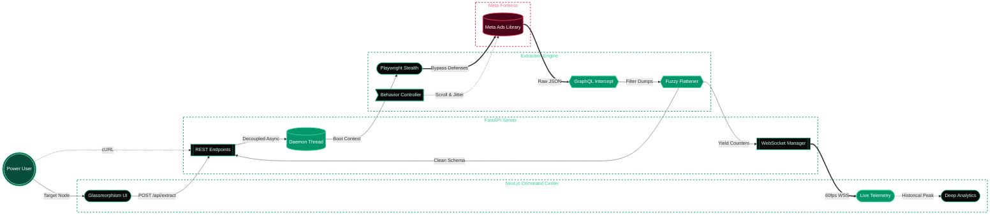

# Viridian Recon

Viridian Recon is a high-performance Meta Ads Library extraction engine. It is engineered from first principles to bypass modern network bot detection while delivering structured data via an ultra-premium glassmorphism command center.

## Architecture
The system is split into a relentless extraction backend and a highly polished reactive frontend.

* **Frontend**: Next.js, Tailwind CSS and Framer Motion. 
* **Backend**: FastAPI, WebSockets and Playwright.
* **Infrastructure**: Completely containerized via Docker.

### System Flow & Extraction Architecture



## Core Capabilities
* **Targeted Extraction**: Search by keyword, page URL or slug.
* **Stealth Operations**: Under-the-radar network interception with resilient infinite scroll handling.
* **Live Telemetry & Diagnostics**: Real-time connection via WebSockets displaying requests per second, system health and total payload size. Features a comprehensive floating Analytics Overlay.
* **Dynamic Aesthetics**: Emerald glassmorphism with true refractive physics. Includes frosted/clear state toggles and pointer-reactive panel edge lighting.
* **Export**: Clean JSON or CSV data dumps.

## How to Target the Engine
Viridian Recon supports two distinct methods for initiating an extraction sequence from the UI Command Center or via API:

1. **Keyword Targeting (General Search)**: 
   If you input a simple keyword (e.g., `nike` or `fitness`), the system automatically encodes and formats the input into a global Meta Ads search URL (searching all active ads worldwide matching that term). This is excellent for broad market recon but may yield ghost-nodes if unauthenticated.
2. **Exact URL Targeting (Surgical Strike)**: 
   If you paste a complete, exact Meta Ads Library URL (e.g., `https://www.facebook.com/ads/library/?active_status=all&ad_type=all&country=ALL&view_all_page_id=15087023444`), the engine will bypass the keyword auto-formatter and navigate directly to that specific competitor's payload. This guarantees hyper-specific page results.

## Setup Instructions

### Option A: Docker (Recommended)
The entire stack is configured for instant deployment. You do not need to configure isolated virtual environments or Node runtimes.

1. Ensure Docker is installed and running on your host machine.
2. Clone the repository and navigate to the root directory.
3. Execute the following command:
   ```bash
   docker-compose up --build
   ```
4. Access the command center at `http://localhost:3000`. The backend socket connects automatically on port 8000.

---

### Option B: Manual Native Setup
For reviewers who prefer native execution without Docker.

#### Prerequisites
* **Node.js** ≥ 20.x and **npm** ≥ 9.x
* **Python** ≥ 3.12

#### 1. Frontend
```bash
# From the repository root
npm install
npm run dev
```
The command center will be available at `http://localhost:3000`.

#### 2. Backend
```bash
# From the repository root — create and activate the virtual environment
Windows (Command Prompt)
python -m venv viridian_recon
viridian_recon\Scripts\activate

Windows (PowerShell)
python -m venv viridian_recon
.\viridian_recon\Scripts\Activate.ps1

Linux & macOS
python3 -m venv viridian_recon
source viridian_recon/bin/activate

# Install Python dependencies
pip install -r backend/requirements.txt

# Install Playwright's Chromium browser and its system-level dependencies
playwright install chromium
playwright install-deps chromium

# Start the API server
cd backend
uvicorn main:app --host 0.0.0.0 --port 8000 --reload
```
The API and WebSocket telemetry endpoint will be available at `http://localhost:8000`.

> **Note:** The `viridian_recon/` virtual environment directory is already excluded from version control via `.gitignore`.

---

## Terminal Mastery
For power users, Viridian Recon can be fully operated headlessly via the terminal:

**1. Trigger Extraction:**
```bash
curl -X POST http://localhost:8000/api/extract \
  -H "Content-Type: application/json" \
  -d '{"target": "nike"}'
```

**2. Monitor Telemetry (requires wscat or similar WebSocket client):**
```bash
wscat -c ws://localhost:8000/ws/telemetry
```

**3. Export Payload:**
```bash
curl -s http://localhost:8000/api/export > payload.json
```

## Testing Suite & Diagnostics
The backend features a robust Pytest suite mimicking complex GraphQL layouts to ensure the extraction flattener operates flawlessly without regressions.

Run the automated test suite locally or inside Docker:
```bash
# Local (with viridian_recon venv activated)
cd backend && python -m pytest tests/ -v

# Docker
docker-compose exec backend pytest tests/
```

Execute run-time diagnostics to verify Playwright capabilities and bindings:
```bash
# Local
cd backend && python diagnostic.py

# Docker
docker-compose exec backend python diagnostic.py
```

---

## License
This project is licensed under a **Proprietary Evaluation License**. See the [LICENSE](./LICENSE) file for the full text. It is provided strictly for internal technical evaluation and recruitment review.
